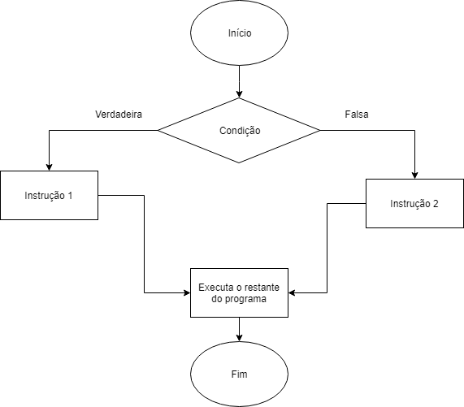

Operadores de comparação
Em algoritmos e lógica de programação, é útil utilizarmos operadores de comparação para criar nossas soluções. Em JavaScript, por exemplo, temos os seguintes operadores:

Operador de Comparação	Descrição
==	Igual a (valor)
===	Estritamente igual a (valor e tipo)
!=	Diferente de
>	Maior que
>=	Maior ou igual que
<	Menor que
<=	Menor ou igual que
Condições if…else
A imagem a seguir exibe o fluxograma exemplificando uma estrutura condicional. Estruturas condicionais são construções utilizadas na programação para tomar decisões com base em condições específicas, permitindo que um bloco de código seja executado apenas se uma determinada condição for verdadeira. SE a condição for verdadeira, ENTÃO faça isso. SENÃO, faça aquilo.

Exemplo de uso da estrutura if...else:

Copiar
const age = 87;

if (age >= 18) {
  console.log('Maior de idade');
} else {
  console.log('Menor de idade');
}
Neste exemplo, a mensagem que será mostrada é “Maior de idade”, pois age é maior ou igual a 18.

Para compreender melhor a estrutura if...else, [veja este vídeo](https://www.youtube.com/watch?v=IsG4Xd6LlsM).

Operador ternário
Você acabou de ver como construir condições com if...else. No entanto, há uma sintaxe mais simplificada para a construção de lógicas condicionais: o operador ternário!

Considere o seguinte problema: você precisa guardar dentro de uma constante a mensagem que traz a informação se uma pessoa pode votar. Com if...else, o código seria o seguinte:

Copiar
const personAge = 17;
let canVote;

if (personAge >= 16) {
  canVote = 'Pode votar!';
} else {
  canVote = 'Não pode votar!';
}

console.log(canVote); // Pode votar!
Com o operador ternário você consegue fazer toda a lógica em apenas 1 linha. A estrutura do operador é a seguinte:

<condição> ? <retorno caso condição seja verdadeira> : <retorno caso condição seja falsa>;

Resolvendo o problema com o operador ternário, teremos o seguinte código:

Copiar
const personAge = 17;

const canVote = personAge >= 16 ? 'Pode votar!' : 'Não pode votar!';

console.log(canVote); // Pode votar!
O operador ternário é mais fácil de ser utilizado e entendido quando “se pega o jeito”, sem falar que é muito mais sucinto do que escrever um bloco condicional com if...else – o que gera um código mais limpo e simples.

Por outro lado, é bom saber que o operador ternário não substitui as expressões condicionais tradicionais. Se você precisa executar um conjunto de código a partir de uma condição, o operador ternário não vai te dar essa possibilidade. Além disso, em qualquer situação em que exista mais de uma condição a ser avaliada, gerando três ou mais resultados possíveis, o mais simples será utilizar as opções já estudadas anteriormente.

[Assista ao vídeo a seguir para aprender um pouco mais sobre operador ternário](https://www.youtube.com/watch?v=atS_A9HHAVo)

🚀 Para fixar
Criar estruturas condicionais com operadores if/else e operadores lógicos será muito comum em sua carreira de pessoa desenvolvedora. Então, vamos praticar essa habilidade!

Crie uma variável chamada grade que receba a nota de uma pessoa candidata em um desafio técnico e atribua um valor entre 1 e 100;
Implemente uma lógica que verifique se a pessoa candidata foi aprovada, reprovada ou se está na lista de espera. Para isso, considere estas informações.
Se grade for maior ou igual a 80, armazene na variável message: “Parabéns, você faz parte do grupo de pessoas aprovadas!”;
Se grade for menor que 80 e maior ou igual a 60, armazene na variável message: “Você está na nossa lista de espera.”;
Se grade for menor que 60, armazene na variável message: “Infelizmente, você reprovou.”.
➡️ Crie uma estrutura condicional utilizando if, else if e else para criar o seu algoritmo e os operadores lógicos que se aplicam a cada situação.
➡️ Altere o valor da nota para verificar se as condições que você implementou funcionam.