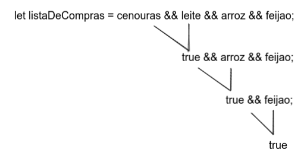

Operadores lógicos
A próxima ferramenta de trabalho que vamos aprender são os operadores lógicos. Na linguagem JavaScript, há três principais operadores lógicos: &&, || e !. Podemos nos referir a eles como “AND“, “OR“ e “NOT“, respectivamente.

Operador Lógico	Descrição
&&	AND (E)
||	OR (Ou)
!	NOT (Negação)
Essas ferramentas vão acompanhar você no JavaScript e em toda a sua carreira. Por isso, é importante praticar o uso delas e se familiarizar com o conceito de cada um dos operadores lógicos.

Operador AND
O operador “AND“ (ou &&, no JavaScript) é binário. Isso significa que ele precisa de dois elementos para funcionar corretamente.

Para abstrair seu funcionamento, pense na seguinte situação: Você está em uma padaria para tomar café da manhã e faz o pedido: “Eu gostaria de um café E um pão na chapa, por favor”.

Seria frustrante se você recebesse apenas o café ou apenas o pão, não é? Ou se recebesse um pão na chapa acompanhado de um caldo de cana, por exemplo. Isso acontece porque a expectativa é de que as duas condições sejam atendidas corretamente. Esse é exatamente o papel do &&. Ele só vai retornar true se as duas operações que estão em volta dele forem consideradas verdadeiras.

Em JavaScript, esse pedido pode ser interpretado da seguinte maneira:

Copiar
const food = 'pão';
const drink = 'café';

if (drink === 'café' && food === 'pão') {
  console.log('Obrigado!');
} else {
  console.log('Erraram meu pedido.');
}
Para exercitar, mude os valores das variáveis. Você vai ver que a condição não vai ser atendida e que, portanto, a mensagem impressa será a que está no else.

Só teremos true se as duas expressões em volta dele forem true também.

E o que acontecerá se houver um encadeamento de &&? 🤔

Considere a seguinte expressão:

Copiar
let carrot = true;
let milk = true;
let rice = true;
let bean = true;

let listaDeCompras = carrot && milk && rice && bean;
Você consegue imaginar qual será o resultado final dessa situação? Vai dar true, pois todas as condições são true 😀.

A ordem que a operação vai obedecer será da esquerda para a direita, semelhante à imagem abaixo.

Precedência de operadores
Outro ponto importante é compreender a precedência de operadores. No caso, ela determina como os operadores são analisados entre si. Operadores com maior precedência tornam-se operandos de operadores com menor precedência, ou seja, o operador de menor precedência trabalhará com o resultado do operador de maior precedência. Observe o código a seguir:

Copiar
console.log(10 + 5 * 5); // 10 + 25
Nesse código, primeiro é realizada a multiplicação 5 * 5, cujo resultado é 25. Depois, é realizada a soma do resultado dessa multiplicação com 10, ou seja, 25 + 10.

Assim como na matemática, primeiro realiza-se a multiplicação e, depois, a soma. Portanto, o retorno desse código é 35.

Para fixar
Crie uma variável chamada currentHour que receba um número entre 1 e 24, conforme sua escolha, para representar as horas do dia;

Crie uma variável chamada message que inicialmente seja uma string vazia;

Implemente as seguintes condicionais:

Se o horário for maior ou igual a 22, insira “Não deveríamos comer nada, é hora de dormir” na variável message;

Se o horário for maior ou igual a 18 e menor que 22, insira “Rango da noite, vamos jantar :D” na variável message;

Se o horário for maior ou igual a 14 e menor que 18, insira “Vamos fazer um bolo pro café da tarde?” na variável message;

Se o horário for maior ou igual a 11 e menor que 14, insira “Hora do almoço!!!” na variável message;

Se o horário estiver entre 4 e 11, insira “Hmmm, cheiro de café recém-passado” na variável message.

Agora, imprima a variável message fora das suas condições.