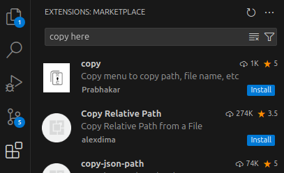
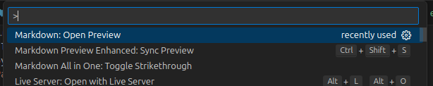

1. Install all extensions inside .vscode/extensions folder
   1. Copy extension name
   2. 

2. Use markdown preview to read the markdown (md) files
   1. Ctrl + Shift + P
   2. 

3. Before each lesson the teacher will tell you what will be the lesson number
   1. You need to read and do the exercises on ALL md files inside that lesson BUT the ones ending with **.ex#** and **.extra** 

4. Ordem da aula:
   1. Ler o material da Trybe do dia especifico
   2. Parar em **aula ao vivo**
   3. Após a nossa  aula fazer os exercício na plataforma da trybe
   4. Fazer os exercícios extras no nosso repositório